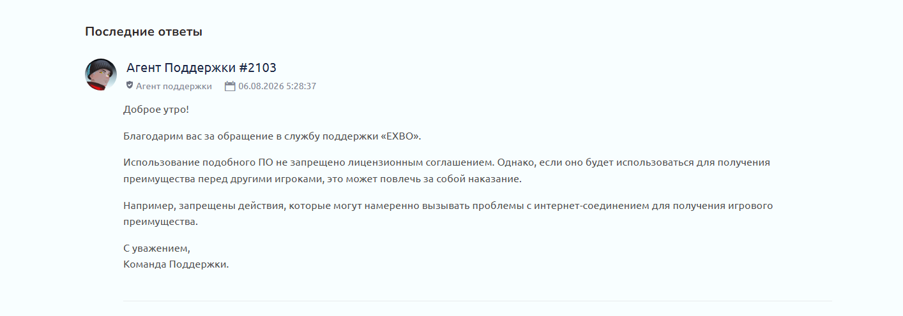

## ⚖️ Официальная позиция техподдержки EXBO / Легальность

Использование данной утилиты **полностью легально** и не нарушает Лицензионное соглашение Stalcraft. 

Программа не является читом, не модифицирует файлы игры и не внедряется в ее оперативную память. С технической точки зрения для античита это выглядит как обычное падение сетевого маршрута у вашего интернет-провайдера.

Ниже представлен официальный ответ службы поддержки EXBO по поводу использования подобного ПО для фильтрации серверов:

> **Цитата из ответа Агента #2103:**
> *«Использование подобного ПО не запрещено лицензионным соглашением. Однако, если оно будет использоваться для получения преимущества перед другими игроками, это может повлечь за собой наказание. Например, запрещены действия, которые могут намеренно вызывать проблемы с интернет-соединением для получения игрового преимущества».*

### ⚠️ Важное предупреждение для пользователей:
Программа создана исключительно для **оптимизации сетевого соединения (снижения пинга и уменьшения потери пакетов)**. 
* Использование утилиты для стабилизации пинга — **РАЗРЕШЕНО**.
* Категорически запрещено использовать настройки сети для создания искусственных лагов в PvP-стычках (лаг-свитчинг) — за это администрация имеет право выдать бан.
